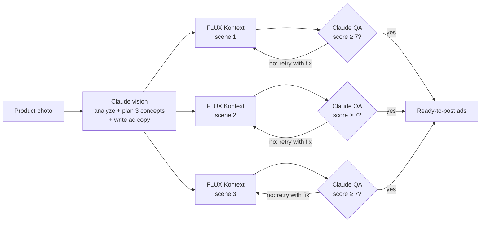

# SnapAd

**One product photo in, three ready-to-post ads out, each quality-checked by AI.**

Small e-commerce brands need fresh ad creatives constantly, but product photoshoots and copywriters are slow and expensive. SnapAd takes a plain product photo and, in under a minute, returns three ad concepts. Each concept has a photorealistic lifestyle image, a headline, a caption and hashtags. An AI reviewer checks every image against the original photo and automatically regenerates any image where the product got distorted.

I built this for my own store, [Gemtechs](https://gemtechs.ge) (gaming peripherals), where every new product needs ad creatives for TikTok, Instagram and Facebook.


<sub>Screenshot taken in demo mode. Add your real screenshot here after a live run.</sub>

## How it works



1. **Analyze and plan** (`Claude`, vision): identifies the product, its features and audience, then plans three concepts with different selling angles. For each concept it writes an image-editing instruction and platform-specific copy.
2. **Generate** (`FLUX.1 Kontext Pro` on Replicate): an instruction-based image editing model places the *exact* product into each new scene. All three concepts run in parallel.
3. **Quality check** (`Claude`, vision): compares each generated image with the original and scores product fidelity and ad quality from 1 to 10. Below the threshold, the reviewer's suggested fix is added to the instruction and the image is regenerated once. The best attempt is kept.

Progress streams to the browser live (NDJSON over a streaming HTTP response), so you can watch each step happen.

## Design decisions

| Decision | Why |
|---|---|
| Image *editing* model instead of text-to-image | The ad must show the real product. Kontext edits the original photo, so shape, colour and logo are preserved. |
| LLM-as-judge QA loop | Generative images sometimes distort the product. An automatic check catches that before a human sees it. |
| One planning call produces scenes and copy together | Headline, caption and image are written to match each other, and it saves an extra LLM round trip. |
| Parallel concept generation | Total time is roughly one generation plus one review, not three of each. |
| Demo mode | Runs the full UI flow with no API keys or cost, for trying it out or running it publicly. |
| Optional access code | Lets the public demo run without exposing your API credits. |

## Run it locally

Requires Python 3.10+.

```bash
git clone https://github.com/<your-username>/snapad.git
cd snapad
python -m venv .venv
# Windows: .venv\Scripts\activate    macOS/Linux: source .venv/bin/activate
pip install -r requirements.txt
cp .env.example .env        # Windows: copy .env.example .env
```

Put your keys in `.env`:

- `ANTHROPIC_API_KEY`: from [console.anthropic.com](https://console.anthropic.com)
- `REPLICATE_API_TOKEN`: from [replicate.com/account/api-tokens](https://replicate.com/account/api-tokens)

Then start it:

```bash
uvicorn app.main:app --reload
```

Open http://localhost:8000. Without keys, it runs in **demo mode** automatically.

### Configuration

| Variable | Default | Purpose |
|---|---|---|
| `SNAPAD_LLM_MODEL` | `claude-sonnet-5-5` | Model for planning, copy and QA |
| `SNAPAD_IMAGE_MODEL` | `black-forest-labs/flux-kontext-pro` | Replicate image editing model |
| `SNAPAD_QA_THRESHOLD` | `7` | Minimum QA score before a retry is triggered |
| `SNAPAD_ACCESS_CODE` | *(empty)* | If set, live runs require this code |
| `SNAPAD_DEMO` | *(empty)* | Set to `1` to force demo mode |

## Deploy (free)

On [Render](https://render.com): create a **Web Service** from this repo.

- Build command: `pip install -r requirements.txt`
- Start command: `uvicorn app.main:app --host 0.0.0.0 --port $PORT`
- Environment: add your two keys and `SNAPAD_ACCESS_CODE`, or set `SNAPAD_DEMO=1` for a public, cost-free demo.

## Cost

A run makes 3 to 6 image generations and 4 to 7 LLM calls. Check current [Replicate](https://replicate.com/pricing) and [Anthropic](https://www.anthropic.com/pricing) pricing. Typically a run costs well under a dollar, compared with a product photoshoot.

## Project structure

```
app/
  main.py       FastAPI server, streaming endpoint, access code
  pipeline.py   Orchestration: analyze → generate → QA → retry
  prompts.py    Creative-director and QA-reviewer prompts
  demo.py       Key-free demo mode
static/
  index.html    Single-page UI (vanilla JS, streams progress)
```

## Roadmap

- Push approved images straight to the product in Shopify (Admin API)
- Short video ads from the best image (image-to-video model)
- Brand kit: fixed colours, tone of voice and banned words per store
- Batch mode for a whole product catalogue
